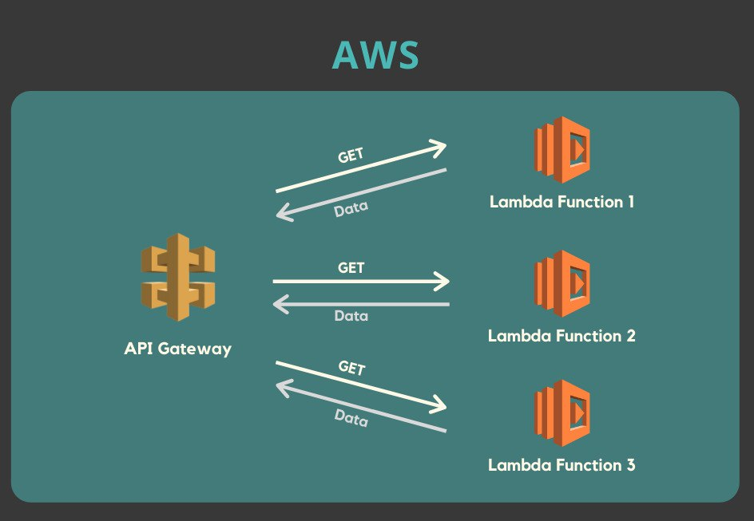
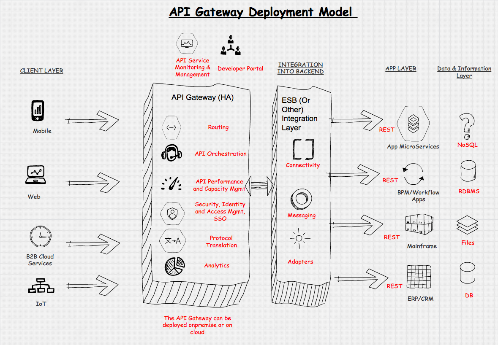

## DAO Enterprise as code

Objetivo: 

> Técnico

Documentar a arquitetura implementada, afim de dessiminar o conhecimento do mapa da arquitetura das aplicações.

> Cultural

Visa tambem, 

> Economico

Acreditamos que aumentamos exponencialmente a taxa de produtividade quando o processo é Documentado e atualizado como um Software.

> Atualização da documentação a partir do código

* Veja que essa documentação sempre será atualuzada quando for realizada a compilação

```python

    npm run up
    ||
    python3 main.py

```
## Arquitetura


## Dependencias

sudo apt install graphviz

pip install diagrams

## Como executar

npm run up

> ## Arquivo Main

 main.py

## Regras para Commit

* - [_] - 
* - [_] - 
* - [_] -

## Pipeline de Atualização da Documentação

Bem aqui é a fonte ...

## Documentação como Código.


## API GW (Forte aliado no gerenciamento das comunicações)



```python

--> msg ([Cadastro de Fasendas])
--> --> Api Gw 
--> --> --> [x] - Servicos_Sincronos (... MS Order, MS Baseline)
--> --> --> [x] - Servico_Assincronos * (... MS Auditoria, MS Cobranca, MS * Reports)
--> --> --> [_] - Servicos_de_proces_Geo_espa
--> --> --> --> --> - [Reques]
--> --> --> --> --> - [Response]
```

## API Gateway Deployment Model

